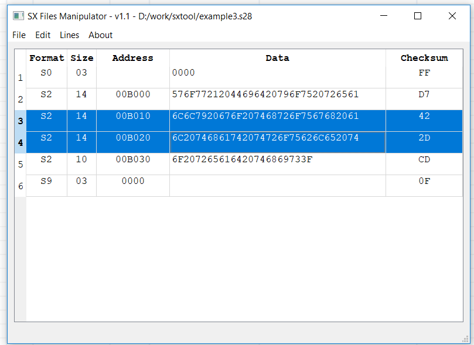
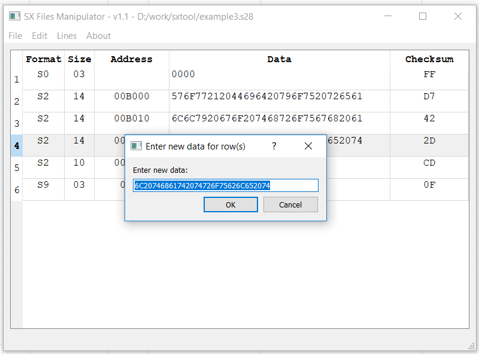
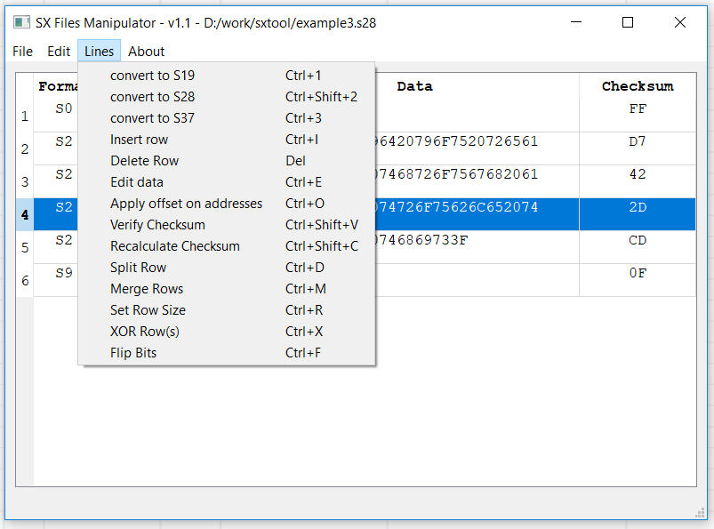

SxTool 
======

SxTool is a very simple tool to work with dump files in ascii
format, like S19, S28 and S37 formats.
You can find specifications of those format at the following address:
https://www.sbprojects.net/knowledge/fileformats/motorola.php

The tool let you perform advanced operation on the file, while 
maintaining checksum, address and data consistency:

- add lines, delete lines, split lines, merge lines
- adjust address, change data, verify or recalculate checksum
- flip the data bits, or XOR the data  content

It is released under GPL license.

SxTool was initially developed by Anthony Portier, Nicolas Chesné,
Philippe Fremy and Gaël Pouger.

Bug reports, improvement requests or praise should be managed on the
GitHub repository https://github.com/bluebird75/sxtool or by email 
to phil.fremy at free.fr .

Release History:
================

2018-12-09: Version 1.1
-----------------------
- first release as Open Source software

Installation
============
On Windows, the simplest is to download the zip files from [the release page](releases). It
contains all the binaries needed to use SxTool.

For other OS and alternatively for Windows, SxTool is distributed in pypi and
may be installed simply with:

    pip install sxtool

Screenshots
===========

